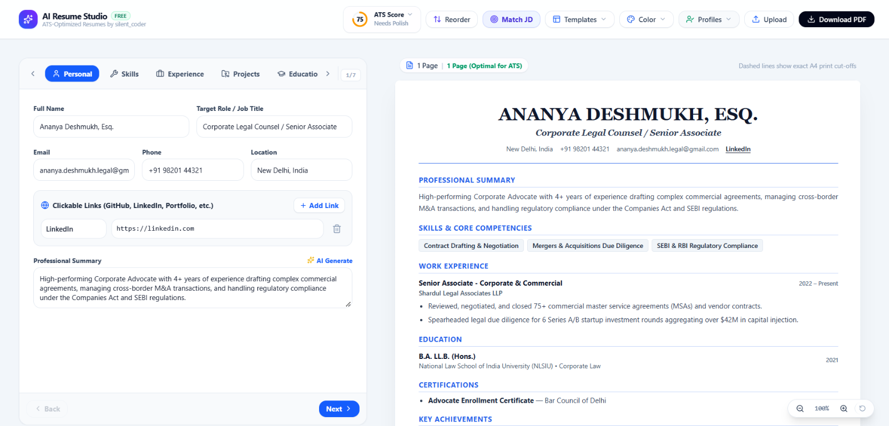
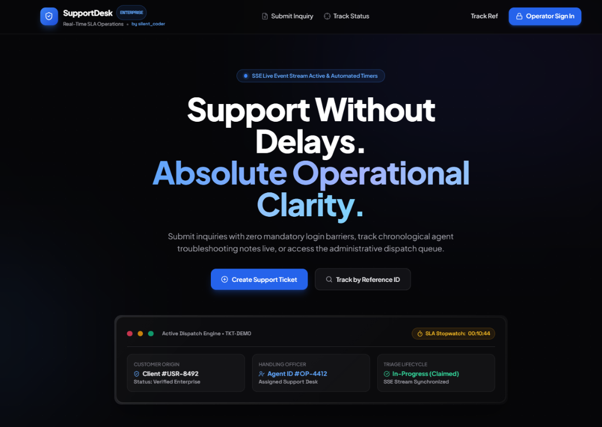
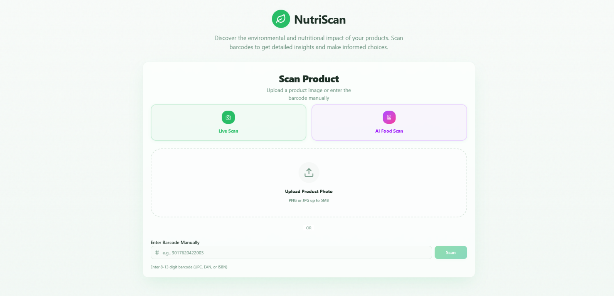

<div align="center">

# Satyam Singh
### Software Developer · Java Backend · AI-Enabled Applications

**A polished, responsive portfolio for showcasing projects, skills, and ways to connect.**

[](https://silently-code.vercel.app/)
[](https://react.dev/)
[](https://vite.dev/)
[](https://tailwindcss.com/)
[](https://www.framer.com/motion/)

<br />

<a href="https://ai-resume-builder-silent.vercel.app/">
  
</a>
<a href="https://support-desk-crm-qs00.onrender.com/">
  
</a>

<br />

<a href="https://nutri-scanner-one.vercel.app/">
  
</a>

</div>

---

## Contents

- [Overview](#overview)
- [Featured projects](#featured-projects)
- [Features](#features)
- [Technology](#technology)
- [Run locally](#run-locally)
- [Project structure](#project-structure)
- [Customize the portfolio](#customize-the-portfolio)
- [Deployment](#deployment)
- [Connect](#connect)

## Overview

This portfolio introduces **Satyam Singh**, a Computer Engineering graduate focused on Java, Spring Boot, backend development, databases, and AI integrations. It brings together project case studies, technical skills, education, profile links, and a contact form in a single responsive React application.

> **Explore the live site:** [silently-code.vercel.app](https://silently-code.vercel.app/)

## Featured projects

| Project | What it does | Links |
| --- | --- | --- |
| **AI Resume Builder** | Generates and optimizes ATS-oriented resumes, with AI-assisted writing, live previews, templates, and PDF export. | [Live demo](https://ai-resume-builder-silent.vercel.app/) · [Source](https://github.com/silent-coder-dev/ai-resume-builder) |
| **SupportDesk CRM** | Full-stack support ticketing with role-based access, ticket workflows, media uploads, and email alerts. | [Live demo](https://support-desk-crm-qs00.onrender.com/) |
| **NutriScan** | Scans food products and presents nutritional and environmental insights. | [Live demo](https://nutri-scanner-one.vercel.app/) |

<details>
<summary><strong>More about the project showcases</strong></summary>

Each project card includes a screenshot, summary, technology tags, implementation highlights, and available repository or live-demo links. The SupportDesk card also includes a copyable example API request.

</details>

## Features

| Area | Included |
| --- | --- |
| **Presentation** | Responsive About, Skills, Projects, Education, and Contact sections |
| **Appearance** | Dark/light themes, accent palette, and a system-preference default |
| **Animation** | Terminal intro, scroll progress, animated sections, interactive project cards, and particle background |
| **Quick navigation** | Searchable command palette with `Ctrl+K` / `⌘K`; press `Esc` to close |
| **Projects** | Screenshots, technology tags, repository and live links, and API example |
| **Contact** | Formspree contact form, copy-email actions, and social profiles |
| **Resume** | Direct download of `public/resume.pdf` as `Satyam_Singh_Resume.pdf` |
| **Accessibility** | Reduced-motion support and device-aware cursor/particle effects |
| **Profile metrics** | GitHub repository and LeetCode totals with fallback values if an external service is unavailable |

## Technology

<div>


</div>

| Purpose | Tools |
| --- | --- |
| UI | React 18, React DOM |
| Build and development | Vite 5 |
| Styling | Tailwind CSS 3 |
| Motion | Framer Motion |
| Icons | React Icons, Lucide React |
| Interactive background | HTML Canvas API |
| Contact form | Formspree |

## Run locally

### Prerequisites

- [Node.js](https://nodejs.org/) 18 or newer
- npm (included with Node.js)

### Install and start

```bash
git clone https://github.com/silent-coder-dev/satyam-portfolio.git
cd satyam-portfolio
npm install
npm run dev
```

Open the local URL printed by Vite—usually <http://localhost:5173>.

### Available scripts

| Command | Description |
| --- | --- |
| `npm run dev` | Start the development server |
| `npm run lint` | Run ESLint |
| `npm run build` | Create the optimized production build in `dist/` |
| `npm run preview` | Preview the production build locally |

## Project structure

```text
public/
├── ai-resume-builder.png     # AI Resume Builder screenshot
├── supportdesk-crm.png       # SupportDesk CRM screenshot
├── nutriscan.png             # NutriScan screenshot
├── resume.pdf                # Downloadable resume
├── avatar.jpg                # Profile image
└── favicon.jpg               # Browser icon / image fallback

src/
├── components/               # Portfolio sections and interactive UI
├── data/
│   └── portfolioData.js      # Profile, skills, metrics, and project content
├── utils/                    # Theme-color and audio helpers
├── App.jsx                   # Application state and page composition
├── App.css                   # Component-level application styles
└── index.css                 # Tailwind entry point and global styles

index.html                    # Document metadata and app mount point
vite.config.js                # Vite configuration
tailwind.config.js            # Tailwind configuration
eslint.config.js              # ESLint configuration
```

## Customize the portfolio

1. **Profile, skills, and projects:** edit `src/data/portfolioData.js`.
2. **Project previews:** replace the images under `public/` while keeping the configured filenames, or update each project's `image` path in `portfolioData.js`.
3. **Resume:** replace `public/resume.pdf`; the site serves this file for the direct download.
4. **Contact delivery:** update `formspreeEndpoint` in `personalInfo` with your Formspree form endpoint.
5. **Social profiles:** update the URLs and usernames in `personalInfo`.

> [!TIP]
> Project screenshots work best in a wide **16:9** format. Optimize large images before committing them so the project section stays quick to load.

### External metrics

GitHub and LeetCode totals are fetched from external services. Rate limits, outages, or browser CORS restrictions can prevent a live refresh; the portfolio retains fallback values so the page remains usable.

## Deployment

The project is a static Vite application and can be deployed to Vercel or another static hosting service.

| Setting | Value |
| --- | --- |
| Build command | `npm run build` |
| Output directory | `dist` |
| Install command | `npm install` |

For Vercel, import the GitHub repository and use the settings above. No server-side runtime is required for the portfolio itself.

## Connect

<div align="center">

| Find me | |
| --- | --- |
| **GitHub** | [@silent-coder-dev](https://github.com/silent-coder-dev) |
| **LinkedIn** | [Satyam Singh](https://www.linkedin.com/in/satyam-singh-05b369376/) |
| **LeetCode** | [@silently_code](https://leetcode.com/u/silently_code/) |
| **Email** | [satyam.singh261103@gmail.com](mailto:satyam.singh261103@gmail.com) |

**[Back to top ↑](#satyam-singh)**

</div>
